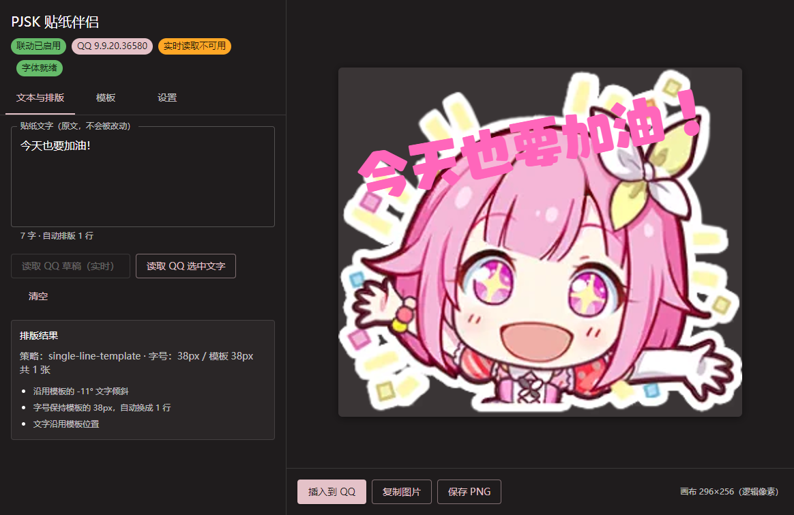

# PJSK QQ 贴纸伴侣

<div align="center">


**在 Windows QQ 聊天时，用 Project SEKAI 角色贴纸素材即时生成带你文字的贴纸图，预览后一键放进输入框。**

</div>



<div align="center">

生成结果（应用真实导出的 PNG，透明背景，296×256 逻辑像素 @2x）：


</div>

> **只有启动这个程序时功能才生效。** 没有开机自启、没有后台服务、没有常驻进程；
> 关掉窗口（或托盘里选「退出」）以后，快捷键注销、辅助进程结束，QQ 侧不留任何东西。

---

## ⚠️ 先读这一节：关于「实时读取 QQ 输入框」

本项目最初的设想是**在你打字时自动读取 QQ 输入框内容并生成贴纸**。实测结论是：
在当前 QQ 版本上**做不到**，而且不是本项目的问题：

| 能力 | 实测结果（QQ 9.9.20.36580 / QQNT） |
| --- | --- |
| 识别前台 QQ 窗口、进程、版本 | ✅ 可以 |
| 通过 UI Automation 访问 QQ 内部控件 | ❌ 不行：UIA 树只暴露 2 个节点（窗口 + `Intermediate D3D Window`），没有 Edit/Document，也没有 ValuePattern |
| 读取输入框里已提交的文字 | ❌ 不可用 |
| 订阅文字变化事件 | ❌ 不可用 |
| 区分输入框 / 搜索框 / 聊天记录 | ❌ 无法从 UIA 区分 |
| 把 PNG 粘贴进 QQ 输入框 | ✅ 可行（系统剪贴板 + Ctrl+V） |

作为对照，同一台机器上 Edge（同样是 Chromium）的 UIA 树有 **418 个节点、31 个可编辑元素**，
说明探测方法本身没问题——是 QQ 主动关闭了 Chromium 的无障碍支持。

因此本程序：

- **默认交付「快捷键兼容模式」**：你在 QQ 里选中文字 → 按一次快捷键 → 程序读到你选中的文字并生成贴纸；
- 在界面上**如实标注「实时读取不可用」并说明原因**，不把它写成已实现；
- **不做**任何越界的事：不收集全局按键、不注入 QQ 进程、不修改 QQ 文件、不使用非官方协议、
  不假设 QQ 的内部 DOM 或私有接口、不读取整个剪贴板历史；
- 实时模式的代码路径已经写好（读取草稿、防抖、不抢焦点的浮窗预览、旧任务不覆盖新结果、
  切换聊天时取消），**如果某个 QQ 版本重新开放 UIA，程序会自动启用它**——
  但这条路径尚未在真实 QQ 上验证通过，请以下方「测试与验证」和
  [desktop/README.md](desktop/README.md) 里的清单为准。

---

## ✨ 功能

- **两种输入方式**：QQ 里选中文字按快捷键读取，或直接在程序里输入 / 粘贴。
- **长文本自动排版，原文一字不改**：字号优先、行数其次，实在放不下才拆成多张贴纸；
  自动换行只影响绘制，文本框中永远是你的原文。
- **多张贴纸**：预览里显示「第 1/3 张」，可逐张复制 / 插入 / 保存，也可批量保存；
  分页是原文的连续切片，不会漏字、不会重复、不会把页码写进图片。
- **模板可选**：788 个贴纸模板（来自 `characters.json`），选择会被记住；
  短句沿用模板的字号、颜色、位置和倾斜，长句才缩小或改用「文字在上、角色在下」的加高画布。
- **不抢焦点的预览浮窗**：打字时预览更新，但键盘焦点始终留在 QQ。
- **导出**：复制图片 / 保存 PNG / 批量保存；默认透明背景，可切换白底以应对 QQ 的兼容问题。
- **托盘常驻**：打开主窗口、暂停/启用联动、查看 QQ 检测状态、退出；
  关闭窗口按钮 = 完全退出，「最小化到托盘」是单独的操作。
- **快捷键冲突可见**：默认 `Ctrl+Alt+S`（插入）与 `Ctrl+Shift+D`（读取选区），
  被别的程序占用时会自动换用可用组合，并在界面上写明换成了什么。

## 🚀 快速开始（桌面版）

需要 Windows 10/11 x64、Node.js 20+。
辅助程序用系统自带的 .NET Framework `csc.exe` 现场编译，**不需要** .NET SDK，也不需要联网。

```powershell
git clone https://github.com/glxpre/pjsk_qq_input.git
cd pjsk_qq_input
npm install

npm run desktop:pack     # 生成免安装便携版到 release/PJSK-Sticker-Companion-win-x64/
npm run desktop:smoke    # 建议跑一次自检（见下）
```

然后双击 `release/PJSK-Sticker-Companion-win-x64/PJSK-Sticker-Companion.exe`。
免安装、免管理员权限、断网可用。

### 怎么用

1. 启动程序，在「模板」标签页挑一个角色贴纸（会被记住）。
2. 在 QQ 输入框里**选中**要转成贴纸的文字，按 `Ctrl+Shift+D`；
   或者直接在程序左侧的文本框里输入 / 粘贴。
3. 右侧看预览，状态区会说明：用的哪个字号、缩小到多少、是否加高了画布、为什么回退横排。
4. 光标放回 QQ 输入框，按 `Ctrl+Alt+S`（或点「插入到 QQ」）：
   - 程序**先确认 QQ 聊天输入框仍是当前焦点**，不是就只复制图片并提示，绝不插到错误的窗口；
   - 然后写入剪贴板并发送一次 Ctrl+V；
   - 结果分三态显示：**已复制** / **已发送粘贴请求** / **已在 QQ 中确认**。
     「已发送粘贴请求」不等于消息已发送——**发不发由你按 Enter 决定，程序从不接管回车**。
5. 也可以「复制图片」「保存 PNG」；多张时还有「复制全部」「批量保存」。

> 完整的桌面版说明（架构、生命周期、QQ 能力探测方法、实测数据、尚未验证清单）
> 在 **[desktop/README.md](desktop/README.md)**。

### 常用命令

| 命令 | 作用 |
| --- | --- |
| `npm run desktop:pack` | 构建 + 组装免安装便携版 |
| `npm run desktop:start` | 构建后直接运行（不打包） |
| `npm run desktop:smoke` | 对打包结果跑端到端自检（启动真实程序并验证素材、字体、快捷键、排版实拍） |
| `npm run desktop:run` | 按用户方式启动一次，检查窗口/托盘/日志/退出 |
| `npm run desktop:screenshot` | 重新生成 `docs/` 里的截图与贴纸样例 |
| `npm run desktop:helper:test` | 单独验证 QQ 接入能力（前台窗口、UIA 元素数、实时读取是否可用） |
| `npm run desktop:dist` | NSIS 安装包（需要管理员权限或开发者模式，原因见 desktop/README） |
| `node tools/diag-layout.ts` | 不启动程序，直接看排版引擎在各种文本上的决策与实测行宽 |

## 🌐 网页版（原有功能，保留）

本仓库同时保留了原项目的网页版贴纸生成器，桌面版是新增的第二个构建目标，
两者共用同一套素材、字体和排版引擎，网页版的逻辑没有被改动。

```bash
npm run dev          # 开发环境
npm run build        # 生产构建（PWA）
npm run build:toy    # toy 平台构建
npm run preview      # 预览生产构建
```

网页版特性：370+ 角色贴纸、多字体、横排/竖排/弧形文字、位置与旋转微调、
描边、动态主题色、PNG/JPG/WebP 导出与剪贴板复制、响应式暗色界面。

## 🛠️ 技术栈


- **界面**：React 18 + TypeScript + Material-UI 5
- **绘制**：HTML5 Canvas 与网页版完全一致的绘制约定（296×256 逻辑画布、中心对齐、模板锚点）
- **排版引擎**：`src/layout/`，只依赖一个 `measureText` 接口，无 DOM 依赖，可单独测试
- **桌面外壳**：Electron 33（窗口 / 托盘 / 全局快捷键 / `app://` 私有协议提供素材）
- **QQ 能力探测**：C# + .NET Framework UI Automation 辅助进程（只读，NDJSON over stdio）

目录结构：

```
src/layout/          排版引擎（字素切分、禁则、字号/行数/分页搜索）
desktop/main/        Electron 主进程、设置、辅助进程客户端、剪贴板竞态
desktop/renderer/    桌面界面、绘制、自检、预览浮窗
desktop/helper/      C# UI Automation 辅助进程与编译脚本
scripts/             构建、打包、自检、截图脚本
tools/               QQ 能力探测与排版诊断工具
```

## 🧪 测试与验证

```powershell
npm run type-check           # 网页 / 共享代码
npm run desktop:type-check   # 桌面代码
npm test                     # 95 项自动化测试
npm run lint                 # 0 error / 0 warning
npm run build                # 网页构建（PWA）
npm run build:toy            # toy 构建
npm run desktop:smoke        # 打包后端到端自检
```

- **95 项自动化测试**全部通过：排版引擎 51 项、桌面绘制 20 项、设置与剪贴板竞态 15 项、
  仓库原有 9 项。
- **打包后自检**会用真实程序验证：资源目录、788 个模板、本地字体、贴纸素材解码、
  全局快捷键注册与释放、辅助进程启停，以及六种文本（短句 / 中文长句 / 中英混排 /
  emoji / 多行 / 341 字超长）的**排版实拍**——原文完整、分页连续、字符未截断、
  实测行宽不超出画布、并统计真实绘制的文字像素数。
- 长文本排版在真实 Canvas 上的耗时：341 字约 **0.55 秒**（此前的实现是 14.4 秒）。

尚未在真实 QQ 中验证的项目（**不要当成已通过**）：实时模式全流程、中文输入法候选阶段、
QQ 里透明/白底 PNG 的实际观感、光标中间编辑后的选区读取、断网干净机器上的安装、
多显示器 / DPI 缩放、NSIS 安装包。详细清单见 [desktop/README.md](desktop/README.md)。

## 🙏 致谢与来源

本项目是 **[25-ji-code-de/stickers-maker](https://github.com/25-ji-code-de/stickers-maker)**
的二次开发：桌面版、排版引擎、QQ 联动是新增的，网页版及其素材、模板数据、字体沿用上游。

上游项目又整合并改进了这些优秀实现：

- **[TheOriginalAyaka/sekai-stickers](https://github.com/TheOriginalAyaka/sekai-stickers)** (MIT License, Copyright (c) 2022 Ayaka) — 原始实现
- **[BedrockDigger/sekai-stickers](https://github.com/BedrockDigger/sekai-stickers)** (MIT License, Copyright (c) 2022 Ayaka) — Material-UI 设计与动态主题提取
- **[atnightcord/sekai-stickers](https://github.com/atnightcord/sekai-stickers)** — 高级文字控制功能参考（该仓库无许可证文件）
- **[u/SherenPlaysGames](https://www.reddit.com/r/ProjectSekai/comments/x1h4v1/)** — 原创贴纸生成器创意

感谢所有原项目的贡献者。

## ⚖️ 许可证与声明

本项目采用 **GNU Affero General Public License v3.0**，详见 [LICENSE](./LICENSE)。

- AGPL-3.0 仅适用于本项目的**原创代码**；
- 游戏相关素材（角色贴纸图像等）的版权归 SEGA、Colorful Palette、Crypton Future Media
  等原版权方所有；
- 本项目包含来自 MIT 许可证项目的代码，详见 [NOTICE](./NOTICE)；
- **AGPL-3.0 要求**：如果你修改本程序并通过网络提供服务，必须向用户提供修改后的源代码。

**免责声明**：本项目受 *Project SEKAI COLORFUL STAGE! feat. Hatsune Miku* 启发，
是非官方、非商业性质的粉丝作品，与 SEGA、Colorful Palette、Crypton Future Media
或任何其他与《Project SEKAI》相关的版权持有方均无官方关联。
本程序不修改、不注入 QQ，也不使用任何非官方协议；它与腾讯及 QQ 没有任何关系。

## 🤝 贡献

欢迎贡献！请先阅读 [贡献指南](./CONTRIBUTING.md) 与 [行为准则](./CODE_OF_CONDUCT.md)。

由于桌面版与 QQ 的交互涉及用户隐私，请特别注意：任何读取聊天内容的改动都必须是
用户显式触发的、只读的、且不会在用户不知情时记录或上传任何文字。

## 🔒 安全

安全问题请查看 [安全政策](./SECURITY.md)。

## 📧 联系方式

- **GitHub Issues**：<https://github.com/glxpre/pjsk_qq_input/issues>

---

<div align="center">

基于 [25-ji-code-de/stickers-maker](https://github.com/25-ji-code-de/stickers-maker) 二次开发

Made with 💜

</div>
